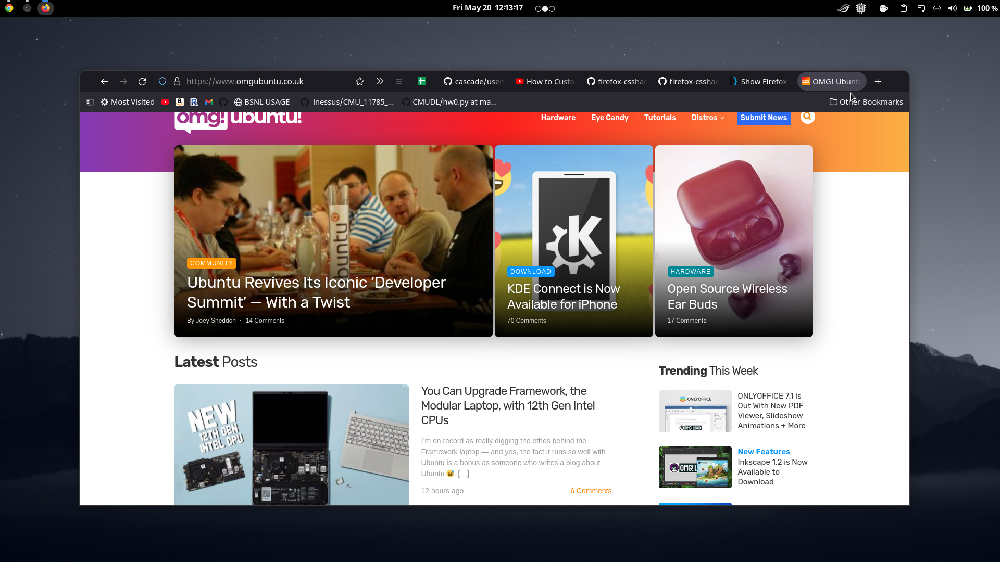

# Custom Firefox Neat Theme



## How to use any userChrome.css theme

1. Type `about:config` into your URL bar. Click on the **I accept the risk** button if you're shown a warning.
2. Seach for **`toolkit.legacyUserProfileCustomizations.stylesheets`**, **`layers.acceleration.force-enabled`**, **`gfx.webrender.all`** and **`svg.context-properties.content.enabled`** and set them to **`true`**.
3. Go to your profile folder:
    - Linux: `$HOME/.mozilla/firefox/######.default-release/`
    - MacOS: `Users/[USERNAME]/Library/Application Support/Firefox/Profiles/######.default-release`
    - Windows: `C:\Users\[USERNAME]\AppData\Roaming\Mozilla\Firefox\Profiles\######.default-release`
4. If it doesn't exist already create a folder called `chrome`.
5. Copy your desired or any `userChrome.css` into that folder.
6. *optional* Customise everything to your liking by analyzing the code.

## Customise the theme to your liking

### Colours

You can use your own colours for the theme. To do so just edit the following block on top of the config section.
By default it will use a dark theme but colour suggestions for light theme users are given as well. Please also change Firefox' theme in your settings to make sure you get the best compatibility.

If you're using a custom colour scheme (e.g. [Firefox Color](https://color.firefox.com)) you can comment out the entire block to use the default colours provided by the Theme Addon.

```css
 :root {
    
    /* main window colour – toolbar & window background */
    --window-colour:    #1E2021;

    /* accent colour – active tab, button hover, ... */
    --secondary-colour: #191B1C;

    /* text and highlight colour */
    --inverted-colour:  #FAFAFC;

}
```

## Keyboard Shortcuts

This userstyle was made for a keyboard centered usage, like Tilling Window Manager users or just cool people that loves them!
These are **some** of the shortcuts that are available:

Windows / Linux | MacOS | Description
--- | --- | ---
`Ctrl + L` | `Command * L` | focuses the URL bar
`Ctrl + B` | `Command + B` | shows you the bookmark sidebar
`Ctrl + Shift + B` | `Command + Shift + B` | shows you the bookmark toolbar
`Alt + Left Arrow` | `Command + Left Arrow` | navigates backwards in your history
`Alt + Right Arrow` | `Command + Right Arrow` | navigates forwards in your history
`Ctrl + T` | `Command + T` | opens a new tab
`Ctrl + Shift + T` | `Command + Shift + T` | reopens the last closed tab
`Ctrl + W` | `Command + W` | closes the current tab
`Ctrl + Page Up`<br/>or `Ctrl + Shift + Tab` | `Command + Option + Left Arrow` | navigates to the previous tab
`Ctrl + Page Down`<br/>or `Ctrl + Tab` | `Command + Option + Right Arrow` | navigates to the next tab

For the full list of shortcuts visit [the official Firefox website](https://support.mozilla.org/en-US/kb/keyboard-shortcuts-perform-firefox-tasks-quickly).
